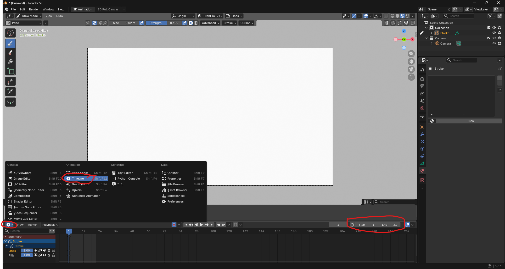
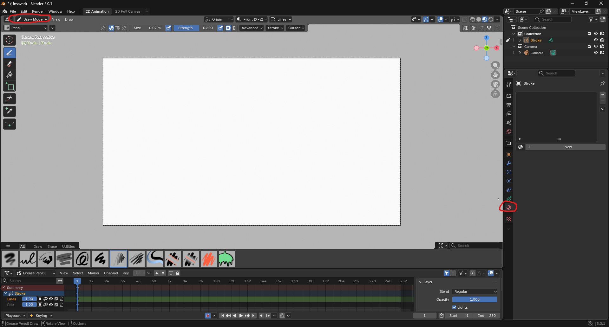
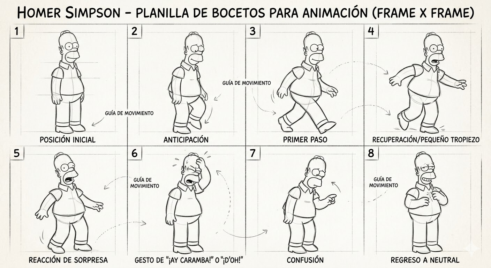
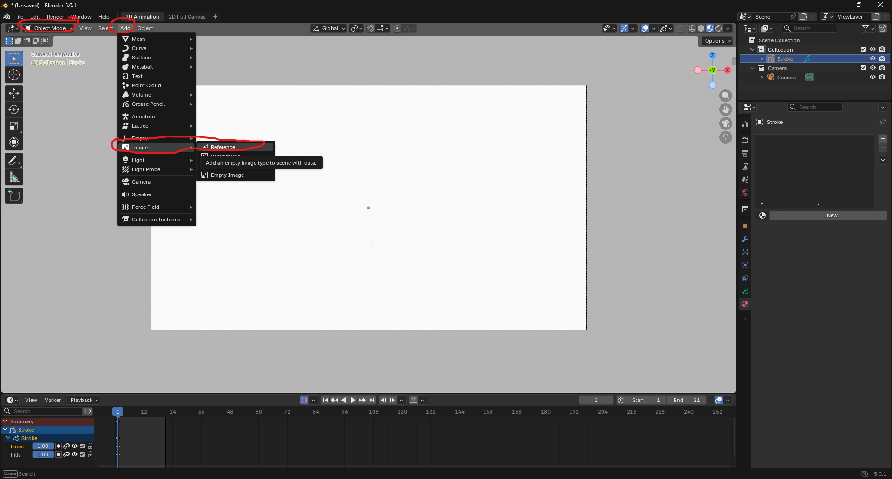
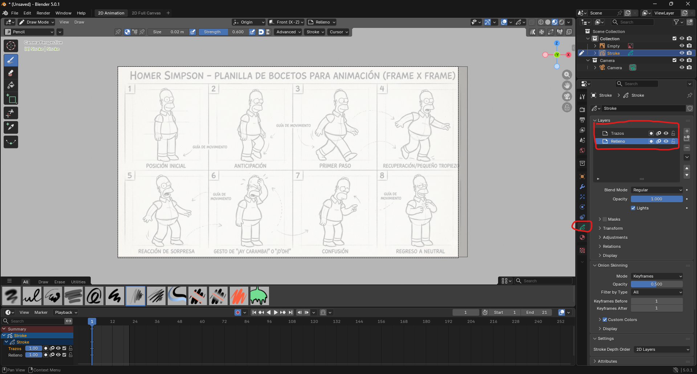
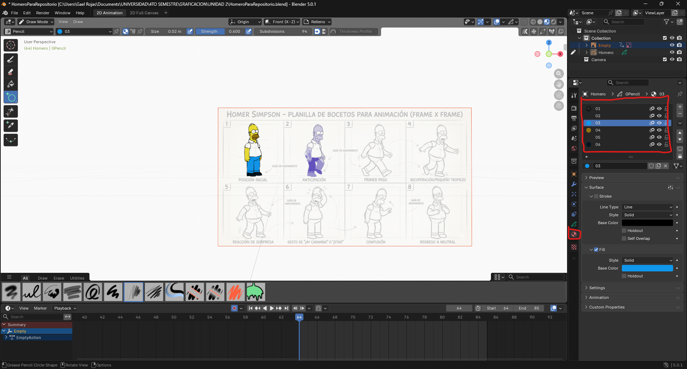
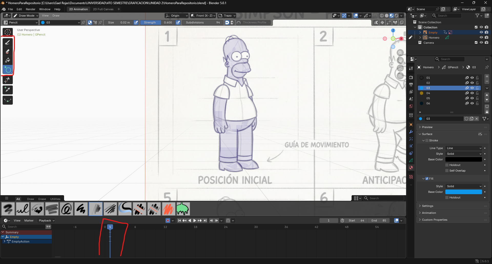
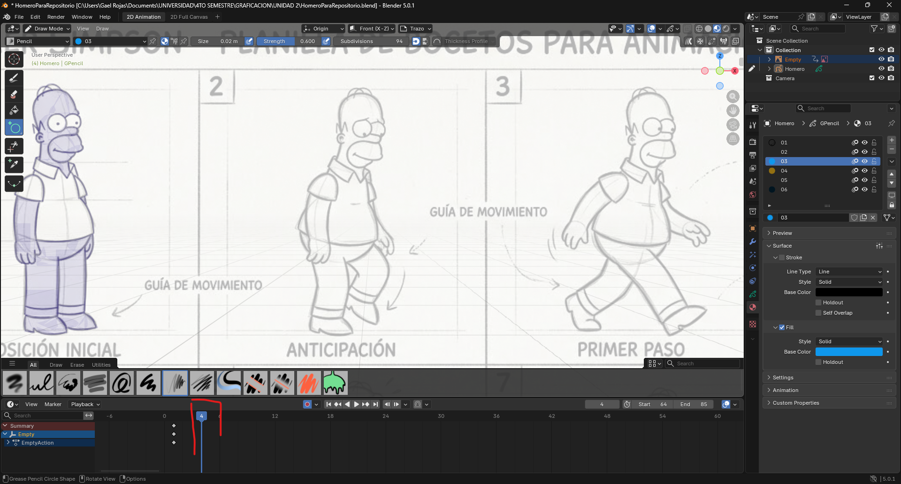
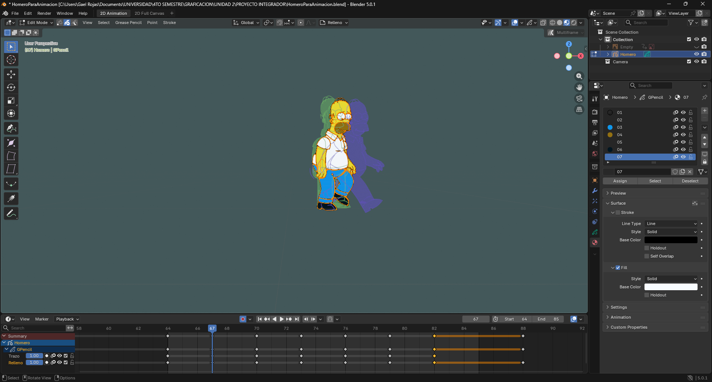

# Proyector-integrador-U2

Para este proyecto integrador haremos una animacion llamada "Walk-cycle" que consiste en dibujar frame por frame algo que quisieramos darle animacion, se dibujan diferentes partes del objeto y al final se unen en una sola para dar ese efecto de que esta siendo "animado".

## Paso 1
para este paso abriremos Blender y al inciar nos aparecera un recuadro, le daremos en "2D animation", ya que trabajaremos en un entorno de animacion 2D

## Paso 2

En este paso deberemos de crear una linea del tiempo, esto para saber en que frames dibujar y hacer nuestros trazos en los frames especificos, se recomienda empezar del primer frame para no tener inconviencia, en este caso como haremos 7 dibujos y esos dibujos se cambiaran cada 3 frames elegimos en la parte inferior derecha un intervalo que empieza de 1 y termina en el frame 21.

## Paso 3
Una vez que ya tengamos nuestro entorno para trabajar se debera de ver algo asi:

Deberemos de borrar todos nuestros materiales para crear los nuestros, esto lo veremos en los pasos mas adelante, mientras tambien deberemos de cambiar el Draw mode a Object mode, ya que tendremos que agregar primeramente nuestra referencia, esta referencia es la siguiente:

Y ya por ultimo la agregaremos a nuestra estacion de trabajo, bajaremos opacidad y la centraremos para que quede a la medida deseada del dibujo

## Paso 5

En este paso haremos las capas, una se haran puros trazos o los contornos de nuestro dibujo y en otra capa haremos el relleno o el pintado de nuestro dibujo, esto para que al momento de rellenar con los colores nos facilite mas la tarea al momento de borrar colores salidos del contorno con mucha mas facilidad

## Paso 6

Ahora si crearemos nuestros materiales el material 01 es nuestro pincel para ir haciendo los contornos de nuestros bocetos, y del 02 al 06 son basicamente los colores que ocuparemos para iluminar a nuestro personaje y no quede sin color.

## Paso 7

Nos posicionamos en el primer frame para empezar a dibujar nuestro primer boceto, Al lado superior izquierdo tendremos las herramientas que utilizaremos para hacer nuestros bocetos, recuerda que se debe de estar en draw mode para activar estas funciones

Y ya cuando terminemos nuestro primer dibujo nos posicionaremos 3 frames despues del que estamos que en este caso es 1, entonces pondriamos nuestro siguiente dibujo en el frame 4, y asi sucesivamente para todos los demas.

## Paso 8

Una vez que tenemos todos los dibujos seleccionamos el edit mode, nos posicionamos en cada frame que hicimos los dibujos, en este caso si nos posicionamos en el frame 1 nos mostrara el primer dibujo que hicimos, de aqui es Darle a la letra "A" para seleccionar todo nuestro dibujo y despues la letra "G" para moverlo libremente, cada dibujo lo posicionaremos en medio de nuestro plano (Para este caso) porque asi da la ilusion de la animacion.

## Resultado final

Este es nuestro resultado final, al apilar las imagenes y darle play a la animacion se crea el siguiente movimiento que en este caso es de nuestro homerito

<video src="https://github.com/gael-rojas/Proyector-integrador-U2/raw/main/imagenes/Video.mp4" autoplay loop muted playsinline width="100%">
</video>

