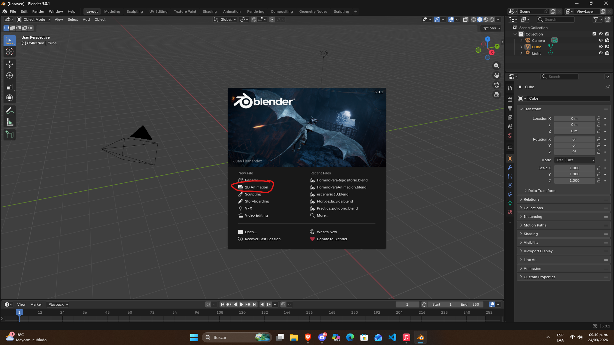

# Proyector-integrador-U2

Para este proyecto integrador haremos una animacion llamada "Walk-cycle" que consiste en dibujar frame por frame algo que quisieramos darle animacion, se dibujan diferentes partes del objeto y al final se unen en una sola para dar ese efecto de que esta siendo "animado".

## Paso 1
para este paso abriremos Blender y al inciar nos aparecera un recuadro, le daremos en "2D animation", ya que trabajaremos en un entorno de animacion 2D

